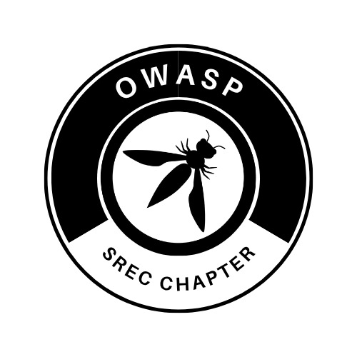

---

layout: col-sidebar
title: OWASP Sri Ramakrishna Engineering College
tags: example-tag
region: Asia
country: India
meetup-group:

---

  
  

## Welcome
### Greetings Cybersecurity Aficionados!

Step into the electrifying realm of the Sri Ramakrishna Engineering College (SREC) chapter of the Open Web Application Security Project (OWASP). We're thrilled to welcome you to our cybersecurity adventure, where our mission is to safeguard web applications and champion the cutting-edge frontiers of cybersecurity.

As honored members of the OWASP family, SREC's dedication is unwavering. Our goal is to foster a dynamic community of cybersecurity enthusiasts, bound by a shared passion for pushing the boundaries of web application security in today's ever-evolving digital landscape.

### Our Mission at SREC:

At SREC, our mission is crystal clear—to empower individuals and organizations in the daring quest to construct, sustain, and fortify secure web applications. In the face of dynamic cyber challenges, our community stands as a beacon of knowledge-sharing, collaboration, and perpetual learning.

### Why Join Us:

Embark on this exhilarating journey through the intricacies of cybersecurity, where each member plays a crucial role in fortifying our digital frontiers. At SREC, we take pride in being a hub of expertise, uniting forces to propel the realm of web application security forward. Together, we forge an indomitable alliance, ensuring a more resilient and secure digital future for all.

### What We Offer:

Knowledge Summit: Gain access to a treasure trove of information, resources, and expertise in the dynamic field of web application security.
Collaborative Oasis: Engage with kindred spirits, fostering connections and partnerships for mutual ascension.
Continuous Learning Odyssey: Stay ahead of the curve with the latest trends, threats, and best practices through immersive workshops, enlightening seminars, and riveting events.
Join us at SREC, where cybersecurity adventurers converge to leave an indelible mark on the security landscape. Together, let's shape a digital future that stands as a testament to resilience and security.

## Participation
The Open Worldwide Application Security Project (OWASP) is a nonprofit foundation that works to improve the security of software. All of our projects, tools, documents, forums, and chapters are free and open to anyone interested in improving application security. 

Chapters are led by local leaders in accordance with the [Chapters Policy](/www-policy/operational/chapters). Financial contributions should only be made online using the authorized online donation button. 

Everyone is welcome and encouraged to participate in our [Projects](/projects/), [Local Chapters](/chapters/), [Events](/events/), [Online Groups](https://groups.google.com/a/owasp.com/){:target='_blank'}, and [Community Slack Channel](https://owasp.slack.com/){:target='_blank'}. We especially encourage diversity in all our initiatives. OWASP is a fantastic place to learn about application security, to network, and even to build your reputation as an expert. We also encourage you to be [become a member](/membership/) or consider a [donation](/donate/) to support our ongoing work.

<!-- Next Meeting/Event <!-- You should keep this section as it will populate your meetup events -->
---------------------

 

